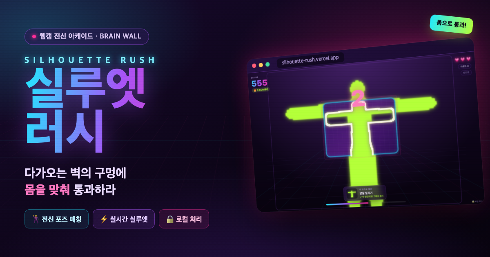
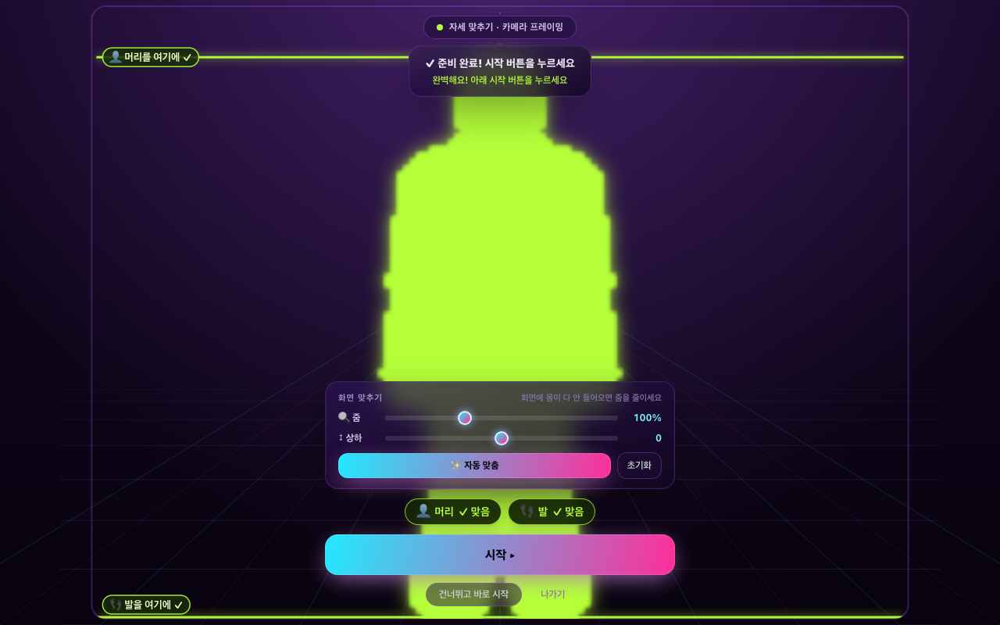

# 실루엣 러시 (Silhouette Rush)



> **몸으로 통과하는 벽.** 웹캠 앞에서 포즈를 잡아 다가오는 벽의 구멍 모양에 몸을 맞춰 통과하는 전신 아케이드 게임. 일본/한국 예능 *브레인월(Hole in the Wall)* 컨셉의 브라우저판.

<p>
  
  
  
  
  
  
</p>

## 🔗 라이브 데모

**▶ [silhouette-rush.vercel.app](https://silhouette-rush.vercel.app)**

> 데스크톱 + 웹캠 환경을 권장합니다. 카메라가 없어도 **데모 모드**로 게임 플레이를 볼 수 있어요.

---

## 🎮 게임 방법

1. **카메라 켜기** — 브라우저 카메라 권한을 허용하면 전신이 네온 실루엣으로 변신합니다.
2. **자세 맞추기(프레이밍)** — 게임 시작 전, 화면에 **머리선·발선 가이드**가 뜹니다. **줌 슬라이더로 카메라 화면을 게임 프레임에 맞게 축소/확대**해 (또는 앞뒤로 움직여) **머리를 위 선, 발을 아래 선**에 맞추면 선이 초록색으로 바뀝니다. 방이 좁아 뒤로 못 물러나도 **줌을 줄이면** 머리~발이 선 안에 들어와요. **✨ 자동 맞춤** 버튼 한 번이면 현재 실루엣을 재서 알아서 맞춰줍니다. 초록불이 켜지면 **직접 [시작] 버튼**을 눌러 라운드를 시작합니다(자동 시작 없음 · 건너뛰기 가능).
3. **구멍에 몸 맞추기** — 무대 안쪽에서 **구멍 뚫린 벽이 다가옵니다.** 벽이 도달하는 순간, 구멍(빈 공간) 모양에 몸을 맞추고 있으면 **통과**, 벽의 채워진 부분에 부딪히면 **충돌**!

라운드가 진행될수록 벽이 더 빨리 오고, 포즈가 더 어렵고 비대칭적이며, 통과 판정도 점점 빡세집니다. 하트 3개를 모두 잃으면 게임 오버.

## ✨ 주요 기능

- 🧍 **실시간 인체 세그멘테이션** — [MediaPipe **Selfie Segmenter**](https://ai.google.dev/edge/mediapipe/solutions/vision/image_segmenter)로 실루엣 마스크를 추출. 영상 전용 경량 모델이라 브라우저에서 30–60fps, **GPU(WebGL) 델리게이트 우선·CPU 폴백**. 추론은 메인 스레드에서 돌지만 모델이 가볍고 **프레임 드롭 + 마스크 시간 보간(EMA)**으로 게임은 항상 60fps로 렌더됩니다.
- 🎯 **몸 정렬 가이드선 + 프레이밍 단계** — 포즈 구멍은 "머리=위, 발=아래"라는 고정 프레임에 그려집니다. 그 프레임과 **정확히 일치하는 머리선·발선·중앙선**을 캔버스에 그려, 시작 전 **자세 맞추기** 단계에서 세그멘테이션 마스크의 실제 머리/발 위치를 계산해 근접하면 선을 초록색으로 바꾸고 방향 힌트를 줍니다. 가이드선에 몸을 맞추면 실제로 포즈가 성립 — "어디에 서야 할지 모르겠다"는 문제를 해결. 정렬이 맞으면 **[시작] 버튼이 활성화**되고, 라운드는 **직접 버튼을 눌러야** 시작됩니다(맞추기 전에 저절로 시작되지 않음). 플레이 중에도 가이드선을 은은하게 유지합니다.
- 🔍 **카메라 줌(프레이밍) 조절 — 좁은 방 대응** — 머리·발을 두 선에 맞추려면 카메라가 온몸을 담아야 하는데 좁은 방에선 물러날 공간이 없습니다. **줌 슬라이더(0.5×~2.0×)와 상하 위치(±0.3)** 로 카메라 프레임을 게임 프레임에 맞게 **축소(패딩)/확대(크롭)** 할 수 있어, 가까이 서 있어도 머리~발이 선 안에 들어옵니다. 이 변환은 **세그멘테이션 입력 프레임과 화면 실루엣(matte)에 동일하게** 적용돼 가이드선 정렬과 통과 판정이 일관됩니다. **✨ 자동 맞춤**은 현재 실루엣의 상·하단을 재서 줌·오프셋을 한 번에 계산하고, 값은 `localStorage`에 저장돼 다음 실행·인게임(작은 줌 컨트롤)에 그대로 이어집니다.
- 🎯 **픽셀 겹침 판정** — 벽의 채워진 픽셀과 플레이어 실루엣의 **겹침 비율**로 통과/충돌을 판정.
- 🕺 **20종 포즈 구멍 · 난이도 티어** — 차렷·양팔 벌리기·A자·만세·골대·한 팔 옆·한 팔 번쩍·기울이기·한 손 허리·대각선·가슴 앞 X·점프 스타·옆차기·무릎 올리기·나무·반대 기울이기·웅크리기·깊은 웅크리기·복합 비대칭 등. **좌우 비대칭 포즈**를 적극 활용해 변별력을 높였고, easy→hard 5단계 티어로 라벨링.
- 📈 **점점 어려워지는 난이도 곡선** — 초반은 크고 쉬운 대칭 포즈 + 느린 벽 + 관대한 판정(진입장벽↓), 라운드가 오를수록 **① 벽 접근 속도↑ ② 포즈 티어↑(좁고 비대칭)** ③ **통과 판정 관용도↓**(충돌 허용 0.24→0.11, 요구 채움 0.26→0.34). **셔플백(최근 N개 제외)** 출제로 같은 포즈가 연속으로 나오지 않습니다.
- 💯 **점수 · 콤보 · 하트** — 통과할 때마다 콤보 배수가 붙고, 라운드가 오를수록 난이도 상승.
- 🎇 **네온 게임쇼 연출** — 원근감 있게 밀려오는 벽, 실루엣 글로우(맞으면 라임 그린, 부딪히면 핫핑크), 통과 파티클·충돌 흔들림.
- ⏱️ **3·2·1 카운트다운** — 벽이 다가오는 게이지 + 카운트다운으로 포즈 잡을 여유를 제공.
- 📸 **결과 스코어 카드** — 최종 점수와 마지막 실루엣 스냅샷을 캔버스로 합성해 **이미지 저장 / 클립보드 복사**. 실패 짤 공유용.
- 🔒 **완전 프론트엔드** — 카메라 영상은 서버로 전송되지 않고 **기기 안에서만** 처리됩니다. 서버·API 키 없음.

## 🧠 어떻게 동작하나

```
                    [메인 스레드 · 렌더 60fps]
웹캠 프레임 ─(rVFC로 최신 1장만, 좌우반전 + 줌/오프셋 256×192)─▶ MediaPipe Selfie 세그멘테이션(GPU/WebGL)
      │                        ▲                                   │
      │                        │  추론 중이면 프레임 드롭            ▼
      │                    최신 마스크 ◀───────── 알파 마스크 + 128×96 게임 그리드
      ▼                        │
  네온 실루엣 렌더링 ◀── 마스크 시간 보간(EMA)으로 60fps 부드럽게 채움
                               │
   벽 마스크(포즈 구멍) ─── 겹침 픽셀 판정 ─── 통과 / 충돌 · 점수 · 콤보 · 하트
```

- **메인 스레드에서 GPU(WebGL) 델리게이트로 추론**합니다. MediaPipe wasm 로더는 워커의 `importScripts`에 의존해 ES-module 워커에선 `ModuleFactory not set`으로 실패하는데, 메인 스레드로 옮겨 이 문제를 원천 제거했습니다. 모델이 가벼워 렌더 루프를 실질적으로 막지 않고, GPU 델리게이트도 여기서 안정적으로 붙습니다.
- **최신 프레임만 처리(프레임 드롭)** — `requestVideoFrameCallback`으로 매 웹캠 프레임을 받되, 이전 추론이 진행 중이면 건너뛰어 지연이 쌓이지 않습니다.
- **마스크 시간 보간(EMA)** — 세그멘테이션 업데이트 사이를 지수 이동평균으로 메꿔, 업데이트가 드물어도 실루엣이 끊기지 않고 부드럽게 이어집니다. (판정용 마스크는 반응성 위주의 짧은 시정수.)
- **줌/오프셋은 캡처 전처리 계층**입니다. 웹캠 프레임을 work 캔버스에 그릴 때 중심 기준 스케일 + 오프셋(+좌우반전)으로 변환하므로, 세그멘테이션이 보는 프레임과 화면에 그려지는 실루엣이 **동일한 변환을 타** 가이드선 정렬·판정이 일관됩니다. 판정 모듈(`masks.ts`/`engine.ts`)은 변환을 전혀 모른 채 순수하게 유지됩니다.
- **입력 소스를 인터페이스로 분리**했습니다. 게임 로직은 `MaskSource`(실제 웹캠) 또는 `FakeMaskSource`(주입형) 어느 쪽으로도 구동됩니다. `FakeMaskSource`도 동일한 줌 변환을 적용해, 슬라이더 값 변경이 실제로 마스크 인체 높이를 바꾸는지 헤드리스로 수치 검증할 수 있습니다.
- **판정·점수·라운드·게임오버 로직은 DOM/모델 없는 순수 모듈**(`src/game/masks.ts`, `src/game/engine.ts`)이라, 합성 마스크로 자동 검증이 가능합니다.

```bash
npx tsx verify/verify.ts   # 구멍에 맞는 마스크=통과, 어긋난 마스크=충돌 등 자동 검증
```

## 🛠️ 기술 스택

- **React 19** + **TypeScript** + **Vite 8**
- **Tailwind CSS v4** (`@tailwindcss/vite`)
- **@mediapipe/tasks-vision** (Selfie Segmenter, 메인 스레드 GPU(WebGL)/WASM, CDN 로드)
- Canvas 2D 렌더링 · `requestVideoFrameCallback` · `getUserMedia` · `localStorage`(최고 점수)

## 💻 로컬 실행

```bash
npm install
npm run dev
```

빌드 & 검증:

```bash
npm run build            # 타입체크 + 프로덕션 빌드
npx tsx verify/verify.ts # 게임 코어 로직 자동 검증
```

## 📁 프로젝트 구조

```
src/
├─ game/
│  ├─ masks.ts             # 마스크 유틸 + 20종 포즈 구멍 + 정렬 기준 프레임(BODY_FRAME) + 겹침 판정(순수)
│  ├─ engine.ts            # 게임 상태 머신: 벽 접근·라운드별 판정 강화·셔플백 출제·점수·콤보·하트(순수)
│  ├─ segmentation.ts      # MediaPipe Selfie Segmenter 로드·추론(메인 스레드 GPU→CPU) + 모델 다운로드(진행률)
│  ├─ maskSource.ts        # MaskSource 인터페이스 · WebcamMaskSource(프레임드롭+EMA) · FakeMaskSource
│  ├─ render.ts            # 네온 무대·원근 벽·실루엣·파티클 캔버스 렌더러
│  ├─ scoreCard.ts         # 공유용 결과 카드 캔버스 생성
│  └─ useSilhouetteRush.ts # 게임 루프 훅(소스 주입 + 테스트 훅)
├─ components/             # StartScreen · FramingOverlay(자세 맞추기) · Hud · GameOverScreen · LoadingOverlay · PosePreview
└─ App.tsx
verify/verify.ts           # 합성 마스크 기반 헤드리스 검증
```

## 📷 스크린샷



---

<sub>영상은 기기를 떠나지 않습니다. · Made with React + MediaPipe</sub>
